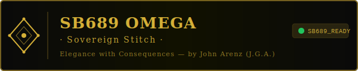

# Append-Only Ledger Protocol

<p align="center">
  
</p>

## Canonical Ledger Schema
```json
{
  "timestamp": "ISO 8601",
  "type": "fact|assumption|rejection|decision|rollback",
  "source": "spine|owner|task|external|healing",
  "content": "string",
  "verified": true,
  "chain_link": "hash_of_previous_entry"
}
```

## No-Silent-Mutation Rule
All material state transitions must be represented by new ledger entries. Existing entries are immutable.

## Querying Audit Trails
- Filter by `type` for facts/decisions/rollbacks.
- Reconstruct exact state at time `T` by replaying entries through `T`.
- Verify integrity via `chain_link` continuity.

## Rollback Procedure
1. Identify last known-good checkpoint hash.
2. Append rollback entry referencing corrupted range.
3. Restore active state from checkpoint replay.
4. Re-run VERA before recommit.

## Example Entries
- Fact: "Verified owner objective is X"
- Assumption: "External API latency < 2s"
- Rejection: "Unsourced claim quarantined"
- Decision: "Applied policy update after VERA pass"
- Rollback: "Drift detected, restored checkpoint abc123"

---

<p align="center">
  <strong>SB-688 — Sovereign Alignment Kernel</strong><br/>
  <em>Jay's Graphic Arts / National Resilience Council</em>
</p>

<p align="center">
  
</p>
